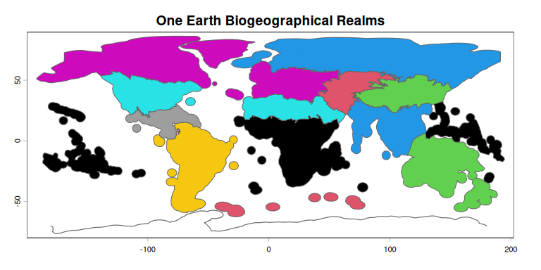
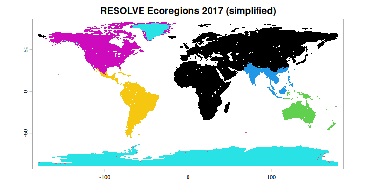

<!-- README.md is generated from README.Rmd. Please edit that file -->

# oneearthr

<!-- badges: start -->

[](https://github.com/alrobles/oneearthr/actions/workflows/test-r-package.yml)
[](https://github.com/alrobles/oneearthr/actions/workflows/cran-preflight.yml)
<!-- badges: end -->

Access the **One Earth Bioregions Framework** spatial layers from R:
biogeographical realms, subrealms, bioregions, and ecoregions (RESOLVE
Ecoregions 2017). All layers ship with the package and work offline.

## Installation

``` r
# install.packages("devtools")
devtools::install_github("alrobles/oneearthr")
# during development:
# devtools::install_github("alrobles/oneearthr-devel")
```

## Usage

``` r
library(oneearthr)
library(terra)
#> terra 1.9.34

oe_layers()
#>        layer   n         scale_small
#> 1     realms  14 ~0.02 deg tolerance
#> 2  subrealms  53 ~0.02 deg tolerance
#> 3 bioregions 185 ~0.02 deg tolerance
#> 4 ecoregions 847 ~0.15 deg tolerance
#>                                                   source
#> 1                    One Earth Bioregions Framework 2023
#> 2                    One Earth Bioregions Framework 2023
#> 3                    One Earth Bioregions Framework 2023
#> 4 RESOLVE Ecoregions 2017 (Dinerstein et al., CC-BY 4.0)
```

``` r
realms <- oe_layer("realms")
plot(realms, col = as.factor(realms$biogeorelm), border = "grey40",
     main = "One Earth Biogeographical Realms")
```



``` r
eco <- oe_layer("ecoregions")          # simplified geometries (packaged)
plot(eco, col = as.factor(eco$realm), border = NA,
     main = "RESOLVE Ecoregions 2017 (simplified)")
```



Full-resolution geometries download on demand and are cached per user:

``` r
eco_full  <- oe_layer("ecoregions", scale = "large")   # ~150 MB, RESOLVE bucket
real_full <- oe_layer("realms", scale = "large")       # One Earth shared folders
```

## Layers

| Layer        | Features | Packaged          | Source                              |
|--------------|----------|-------------------|-------------------------------------|
| `realms`     | 14       | simplified ~0.02° | One Earth Bioregions Framework 2023 |
| `subrealms`  | 53       | simplified ~0.02° | One Earth Bioregions Framework 2023 |
| `bioregions` | 185      | simplified ~0.02° | One Earth Bioregions Framework 2023 |
| `ecoregions` | 847      | simplified ~0.15° | RESOLVE Ecoregions 2017             |

All packaged layers are simplified to keep the install under ~5 MB; use
`scale = "large"` for the original geometries.

## Data & citation

- Dinerstein, E., et al. (2017). An Ecoregion-Based Approach to
  Protecting Half the Terrestrial Realm. *BioScience* 67(6).
  [doi:10.1093/biosci/bix014](https://doi.org/10.1093/biosci/bix014) —
  CC-BY 4.0.
- One Earth Bioregions Framework (2023), <https://www.oneearth.org>.

Data kindly provided by Edward Bell (One Earth).
